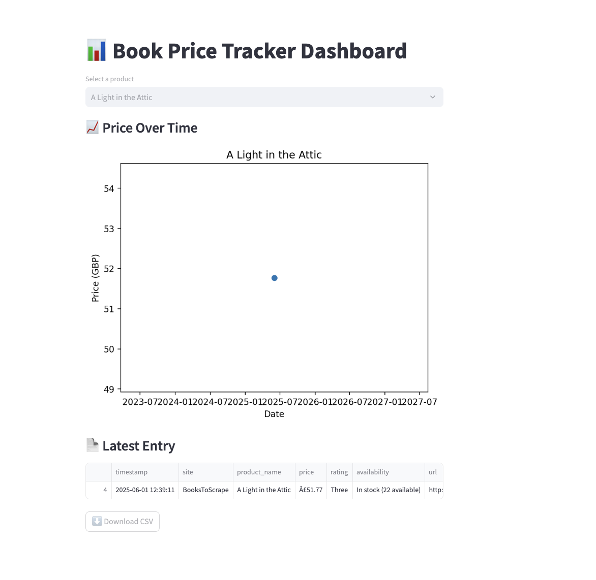

# Ecommerce-price-tracker
Track book prices over time using Python, BeautifulSoup, and Streamlit.
# 📊 Book Price Tracker

This project tracks book prices over time using Python, BeautifulSoup, and Streamlit.  
It scrapes product data from [BooksToScrape.com](http://books.toscrape.com) and visualizes the data on an interactive dashboard.

---

## 🔧 Features

- ✅ Scrapes live product data (title, price, rating, availability)
- ✅ Stores price history in a CSV file
- ✅ Streamlit dashboard with:
  - Line chart of price over time
  - Latest product snapshot
  - CSV export button

---

## 📌 Technologies Used

- `Python 3`
- `requests` + `BeautifulSoup4` for web scraping
- `pandas` for data processing
- `matplotlib` for plotting
- `streamlit` for the dashboard

## 📸 Dashboard Preview




  ```bash
git clone https://github.com/Annei92/ecommerce-price-tracker.git
cd ecommerce-price-tracker

# Install dependencies
    bash
    pip install -r requirements.txt
# Run the scraper
    bash
    python main.py
# Run the dashboard
   bash
   streamlit run dashboard/app.py

# Sample Product
We’re scraping this book:
📘 A Light in the Attic
http://books.toscrape.com/catalogue/a-light-in-the-attic_1000/index.html
